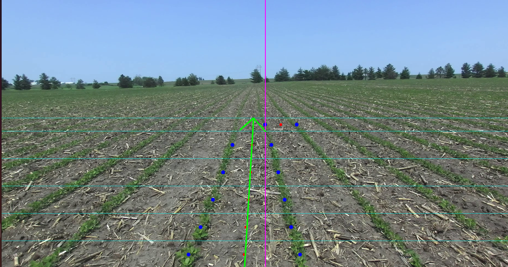

# Visual Servoing for Agricultural Navigation

This project is a solution for a computer vision programming assignment to develop a visual servoing algorithm for an autonomous agricultural robot. The algorithm processes a front-facing camera feed to keep the robot centered between two crop rows by calculating **Heading Error** and **Cross-Track Error**.

High Quality output available at: https://youtu.be/qHs7QrMkym8 


## Features

-   **Robust Lane Detection:** Uses a novel strip-based local peak detection method, making it resilient to noise and perspective changes.
-   **Outlier Rejection:** Implements Z-score filtering on detected centerline points to discard spatial outliers and prevent vector "jumps".
-   **Temporal Smoothing:** Utilizes an exponential moving average on the fitted line parameters to ensure smooth and stable output for video feeds.
-   **Dual-View Visualization:** Generates two real-time video outputs:
    -   **Debug View:** A detailed visualization showing all detected points, image strips, and the final fitted path vector.
    -   **Servo View:** A clean, minimal overlay showing only the robot's intended path vs. the detected path and the final error values, suitable for an operator.
-   **Performance Analysis:** Automatically generates plots for Cross-Track Error and Heading Error over time upon completion.

## Algorithm Breakdown

The core pipeline processes each frame as follows:

1.  **Masking & Denoising:** The input image is converted to the HSV color space to create a binary mask of the green plants. Morphological operations are applied to remove noise and create a clean segmentation.
2.  **Strip-Based Point Detection:** The bottom half of the image is divided into horizontal strips. Within each strip:
    -   A vertical projection of pixel intensities is created.
    -   `scipy.signal.find_peaks` is used to find the x-coordinates of the crop rows.
    -   The two peaks closest to the image center are selected as the left and right boundaries.
    -   The midpoint between these two peaks is stored as a centerline point.
3.  **Outlier Filtering:** The collected set of centerline points is filtered. A Z-score is calculated for their x-coordinates, and any points that are statistical outliers are removed.
4.  **Line Fitting & Smoothing:**
    -   A 1st-degree polynomial (a straight line) is fit to the filtered centerline points using `np.polyfit`.
    -   To ensure temporal stability in video, the slope (`m`) and intercept (`b`) of this line are smoothed using a weighted average with the parameters from the previous frame.
5.  **Error Calculation:**
    -   **Cross-Track Error (CTE):** Calculated as the horizontal distance (in pixels) between the robot's position (center of the image bottom) and where the fitted line intersects the bottom of the image.
    -   **Heading Error (HE):** Calculated as the angular difference (in degrees) between the robot's vertical heading (-90°) and the angle of the fitted line.

## How to Run

### Prerequisites

-   Python 3.x
-   OpenCV (`pip install opencv-python`)
-   NumPy (`pip install numpy`)
-   SciPy (`pip install scipy`)
-   Matplotlib (`pip install matplotlib`)

### Execution

The script is run from the command line.

```bash
cd main
python main.py -i <path_to_video> 
python main.py -i <path_to_image> 
```

**Example:**

```bash
python main.py -i test_video.mp4 -od output/debug_video.mp4 -oc output/servo_video.mp4 --save_debug_frames output/problem_frames
python main.py --input ../Images/Reference.png
python main.py --input ../Videos/soybean.mp4
```

### Command-Line Arguments

-   `-i, --input`: (Required) Path to the input video file.
-   `-oc, --output_clean`: (Optional) Path to save the clean servo output video.
-   `-od, --output_debug`: (Optional) Path to save the detailed debug output video.
-   `--save_debug_frames`: (Optional) Path to a directory where it saves frames with high heading error, useful for debugging difficult scenarios.

## Limitations & Future Work

-   **Fixed Parameters:** HSV thresholds and image crop percentages are hardcoded. Future work could involve adaptive thresholding.
-   **Linear Assumption:** The model assumes straight crop rows. It could be extended by fitting a polynomial curve to handle curved paths.
-   **Advanced Filtering:** The temporal smoothing could be enhanced by implementing a Kalman Filter for predictive tracking, making the system more robust to momentary detection failures.


### My Development Journey: An "Attempt Tree"

My approach to this problem evolved as I uncovered and solved challenges, leading to a more robust and refined algorithm. Here's how I progressed from a basic concept to the final, stable solution.

---

### Step 1: Initial Plant Detection and Noise Removal

* **Goal:** The first step was to reliably separate the green crop rows from the brown soil.
* **Initial Approach:** I used a standard HSV color threshold to create a binary mask of the plants.
* **Problem:** The initial mask was very noisy. It contained many small, isolated white pixels in the soil areas and had gaps within the actual crop rows. This noise would interfere with any attempt to find the rows' centers.
* **Solution:** I applied **morphological operations** (`MORPH_OPEN` and `MORPH_CLOSE`). This "denoising" step effectively removed the small spurious pixels and filled in the gaps within the rows, resulting in a clean, solid mask to work with.


---

### Step 2: The First (Unsuccessful) Attempt at Lane Finding

* **Goal:** To find the center of the path between the two middle crop rows.
* **Initial Approach:** My first idea was to create a **global vertical projection**. I summed up all the white pixel values along the y-axis to create a 1D plot of pixel intensity across the width of the image. The plan was to find the two highest peaks in this plot, assuming they would be the two central crop rows.
* **Problem:** This approach was **highly unreliable**. It was easily thrown off by perspective distortion (where distant rows look closer together) and variations in plant density. It often failed to correctly identify the two central rows, leading to a completely inaccurate and unstable centerline.


---

### Step 3: Breakthrough with a Strip-Based Approach

* **Goal:** Develop a more reliable method to locate the centerline.
* **Solution:** Instead of one global projection, I developed an innovative **strip-based local detection method**. I divided the lower half of the image into horizontal strips and performed the intensity projection *locally within each strip*. This broke the big, unreliable problem into a series of smaller, more manageable ones.
* **Result:** Within each narrow strip, it was much easier to find the two correct peaks corresponding to the crop rows. I then calculated the midpoint between these two peaks to get a single, accurate centerline point for that strip. Repeating this process for all strips gave me a robust set of points mapping the path.


---

### Step 4: Adding Spatial Robustness with Outlier Rejection

* **Goal:** Prevent the final centerline from "jumping" around due to a single bad detection.
* **Problem:** I noticed that in some frames, the detection in one of the strips would fail and incorrectly identify an adjacent crop row. This created an "outlier" point that would dramatically skew the final fitted line, causing it to jump erratically.
* **Solution:** I implemented a **Z-score filter**. Before fitting the line to the centerline points, this statistical method calculates how far each point is from the average. Any point that is a significant outlier is automatically discarded. This simple fix made the line fitting much more stable and immune to single-point detection failures.



---

### Step 5: Achieving Temporal Stability for Video

* **Goal:** To smooth the final output for video and create a stable control signal.
* **Problem:** While the detection was now spatially robust, when processing a video, small variations between frames still caused the final CTE and HE values to be "jittery." This high-frequency noise would be unsuitable for a real robot's control system.
* **Solution:** I implemented an **exponential moving average** on the line's slope and intercept parameters. The parameters for the current frame are a weighted average of the new measurement and the values from the previous frame. This acts as a low-pass filter, smoothing out the jitter and providing a stable, fluid output that is ideal for visual servoing.

